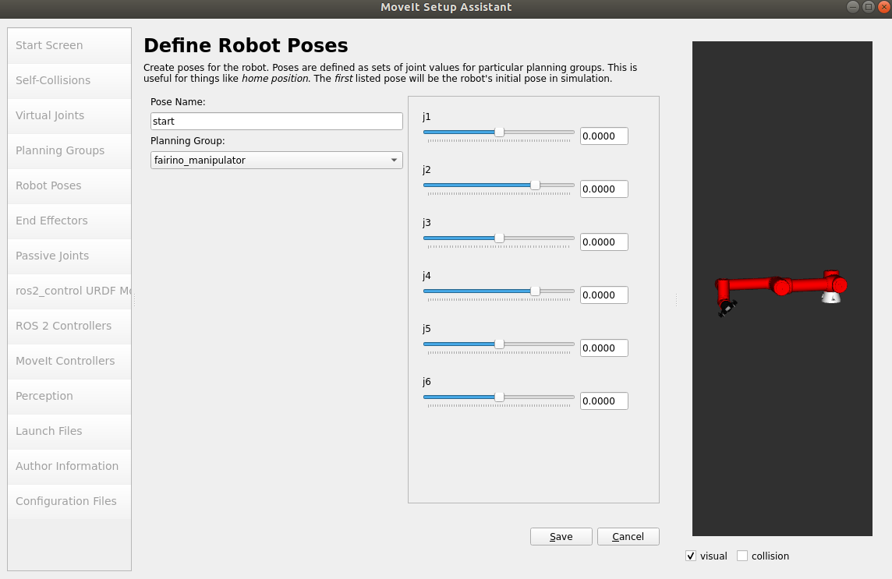
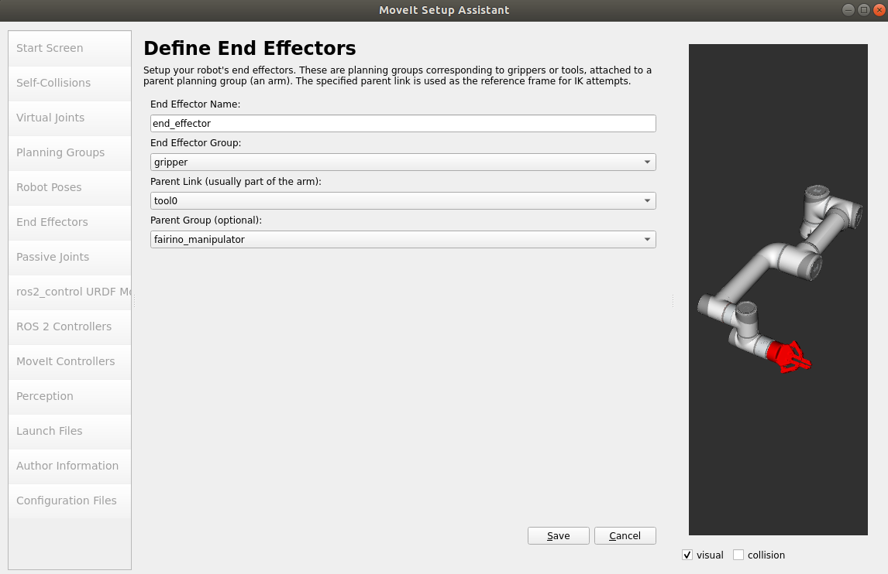

# Create a MoveIt2 Configuration package


# Table of Contents
- [Why Create a MoveIt2 Configuration Package?](#why-create-a-moveit2-configuration-package)
- [Requirements](#requirements)
- [Building a MoveIt2 Configuration Package](#building-a-moveit2-configuration-package)
    - [Load URDF/XACRO file to the Moveit Setup Assistant](#load-urdfxacro-file-to-the-moveit-setup-assistant)
    - [Define the Self Collision Matrix](#define-the-self-collision-matrix)
    - [Define Virtual Joints](#define-virtual-joints)
    - [Define Planning Groups](#define-planning-groups)
    - [Define Robot Poses](#define-robot-poses)
    - [Define End Effector](#define-end-effector)
    - [Setup MoveIt Controllers](#setup-moveit-controllers)
    - [Generate the MoveIt package](#generate-the-moveit-package)
- [Post Setup Adjustments for MoveIt2](#post-setup-adjustments-for-moveit2)
    - [Edit joint_limits.yaml](#edit-joint_limitsyaml)
    - [Edit moveit_controllers.yaml](#edit-moveit_controllersyaml)
- [Motion Planning](#motion-planning)

# Why Create a MoveIt2 Configuration Package?

MoveIt2 is a powerful motion planning framework for ROS 2, enabling robots to execute complex movements with ease. However, before using MoveIt2, you must first **create a MoveIt2 Configuration Package** tailored to your specific robot.

MoveIt2 provides the **MoveIt Setup Assistant**, a tool that generates most of the configuration files automatically. This makes it easier to set up motion planning without manually writing all configuration files.


# Requirements

* ROS 2  (here we use ROS 2 Humble)
* MoveIt2 
* A robot URDF/XACRO file
* Gazebo

# Building a MoveIt2 Configuration Package

### Load URDF/XACRO file to the Moveit Setup Assistant

To use the Setup Assistant, you must provide a URDF or XACRO file that defines the robot's kinematic structure.

* Launch MoveIt2 Setup Assistant:

    ```bash
    ros2 launch moveit_setup_assistant setup_assistant.launch.py
    ```

<p align="center">
  
</p>

* Click on `Create New MoveIt Configuration Package` and select your URDF/XACRO file, then click on `Load Files`.


<p align="center">
  
</p>

You should see your robot appearing on the right hand side. We are now ready to configure the MoveIt2 package.

### Define the Self Collision Matrix

The Setup Assistant automatically identifies link pairs that can be excluded from collision checks.

Select `Self-Collisions` on the left. You can set the `Sampling Density` to the highest value. You can select any value between 95% and 99% for the `Min. collisions parameter for "always"-colliding pairs`. Once set, click on `Generate Collision Matrix`. 
 
 <p align="center">
  
</p>


### Define Virtual Joints

Virtual joints are used to anchor the robot to the world. Essentially, you will create an "imaginary" joint that links the base of your robot to the world, ensuring that your robotic arm is not floating in space.

Select `Add a Virtual Joint` and create a virtual joint named `fixed_base`, which attaches the `base_link` to the `world` frame. This joint will be fixed.


 <p align="center">
  
</p>


### Define Planning Groups

Here we will define two planning groups, one for the arm and another one for the gripper.

Select `Planning Groups` and click on `Add Group`. 

Now, we can create the arm group that will be called `fairino_manipulator`, which will use the `the KDLKinematicsPlugin` Kinematic Solver:

 <p align="center">
  
</p>

Next, click on `the Add Kin. Chain`, then select the both the appropriate `Base Link` and `Tip Link` from the arm (exclude gripper):

 <p align="center">
  
</p>

**Note: It is common practice to set `tool0` as the attachment point between the arm and the gripper.**

For example:

```bash
  <link name="tool0"/>
  <joint name="tool0_joint" type="fixed">
    <parent link="wrist3_Link"/>
    <child link="tool0"/>
    <origin xyz="0 0 0.1" rpy="0 0 0"/>
  </joint>
```

This URDF snippet defines `tool0` as a fixed reference frame attached to `wrist3_Link`, the last joint of the robotic arm. The `tool0_joint` is a fixed joint, ensuring `tool0` remains stationary relative to `wrist3_Link`.


 <p align="center">
  
</p>

We have successfully defined a group of joints to perform motion planning.
Let's now create a new group for the gripper.

Create the gripper group that will be called `gripper`, which will use the `None` Kinematic Solver:

 <p align="center">
  
</p>

Then you can add the joints by selecting `Add Joints` and also you can add links using `Add Links`. At the end you should have something similar to this:

 <p align="center">
  
</p>


### Define Robot Poses

This section defines predefined poses for your groups. Those will be used to set them as goals for example.

Let's define two planning groups for the `fairino_manipulator` group. We will call them `start` and `up`:

 <p align="center">
  
</p>

 <p align="center">
  
</p>

Let's also define two other ones for the `gripper` group: `gripper_close` and `gripper_open`:

 <p align="center">
  
</p>

 <p align="center">
  
</p>

### Define End Effector

Click on `Define End Effector` to define an end effector named `end_effector`.
Set the the `End Effector Group` to `gripper`, then set the `Parent Link` to `tool0`. Finally, set the `Parent Group` to `fairino_manipulator`:

 <p align="center">
  
</p>

### Setup MoveIt Controllers

Here, we will setup the MoveIt Controllers by clicking on `Setup MoveIt Controllers`. Click on `Auto Add FollowJointsTrajectory Controllers For Each Planning Group` button:


 <p align="center">
  
</p>

**Note: We will modify the gripper controller later on.**


### Generate the MoveIt package

Before building teh MoveIt configuration package we need to fill the `Author Information`:

 <p align="center">
  
</p>


Now go to `Configuration Files` and click on `Browse` to select the path where you want your MoveIt package to be located at. Typically it should be under `ros2_ws/src`. You can now name your package. In our example, we called our package `moveit_config_barista`. Finally, click on `Generate Package`.

 <p align="center">
  
</p>

You can now click on `Exit Setup Assistant`.

- Let's now build the workspace:

    ```bash
    cd ~/ros2_ws
    colcon build
    source install/setup.bash
    ```

That's it! You've successfully created a MoveIt package for your robot.


# Post Setup Adjustments for MoveIt2

We are not quite ready to perform motion planning yet. We still need to do two main modifications inside the `config` folder from the MoveIt configuration package:

- Edit `joint_limits.yaml`:

    - modify int values to float
    - Add 3 params:  `has_position_limits`, `min_position` and `max_position`

- Edit `moveit_controllers.yaml`:

    - modify `controller_names` and `action_ns`
    - set correct gripper contoller


Lets go over this:

### Edit `joint_limits.yaml`

The first modification we have to do is very simple, we have to convert every integer values to a float value for instance if you have a value set to `0`, then set it to `0.0`.

Next, you have to add the 3 following parameters:

- `has_position_limits`: 
    - This boolean parameter (`true/false`) specifies whether a joint has position limits.
    - If `true`, the system enforces the limits set by `min_position` and `max_position`.
    - If `false`, the joint can rotate/move freely without limits.
- `min_position`: This defines the minimum position allowed for the joint (in **radians**)
- `max_position`: This defines the maximum position allowed for the joint (in **radians**)

For example our original `joint_limits.yaml` looked like:

```bash
# joint_limits.yaml allows the dynamics properties specified in the URDF to be overwritten or augmented as needed

# For beginners, we downscale velocity and acceleration limits.
# You can always specify higher scaling factors (<= 1.0) in your motion requests.  # Increase the values below to 1.0 to always move at maximum speed.
default_velocity_scaling_factor: 0.1
default_acceleration_scaling_factor: 0.1

# Specific joint properties can be changed with the keys [max_position, min_position, max_velocity, max_acceleration]
# Joint limits can be turned off with [has_velocity_limits, has_acceleration_limits]
joint_limits:
  j1:
    has_velocity_limits: true
    max_velocity: 3.1499999999999999
    has_acceleration_limits: false
    max_acceleration: 0
  j2:
    has_velocity_limits: true
    max_velocity: 3.1499999999999999
    has_acceleration_limits: false
    max_acceleration: 0
  j3:
    has_velocity_limits: true
    max_velocity: 3.1499999999999999
    has_acceleration_limits: false
    max_acceleration: 0
  j4:
    has_velocity_limits: true
    max_velocity: 3.2000000000000002
    has_acceleration_limits: false
    max_acceleration: 0
  j5:
    has_velocity_limits: true
    max_velocity: 3.2000000000000002
    has_acceleration_limits: false
    max_acceleration: 0
  j6:
    has_velocity_limits: true
    max_velocity: 3.2000000000000002
    has_acceleration_limits: false
    max_acceleration: 0
  robotiq_85_left_finger_tip_joint:
    has_velocity_limits: true
    max_velocity: 100
    has_acceleration_limits: false
    max_acceleration: 0
  robotiq_85_left_inner_knuckle_joint:
    has_velocity_limits: true
    max_velocity: 100
    has_acceleration_limits: false
    max_acceleration: 0
  robotiq_85_left_knuckle_joint:
    has_velocity_limits: true
    max_velocity: 0.5
    has_acceleration_limits: false
    max_acceleration: 0
  robotiq_85_right_finger_tip_joint:
    has_velocity_limits: true
    max_velocity: 100
    has_acceleration_limits: false
    max_acceleration: 0
  robotiq_85_right_inner_knuckle_joint:
    has_velocity_limits: true
    max_velocity: 100
    has_acceleration_limits: false
    max_acceleration: 0
  robotiq_85_right_knuckle_joint:
    has_velocity_limits: true
    max_velocity: 100
    has_acceleration_limits: false
    max_acceleration: 0
```
And this is our updated `joint_limits.yaml`:

```bash
# joint_limits.yaml allows the dynamics properties specified in the URDF to be overwritten or augmented as needed

# For beginners, we downscale velocity and acceleration limits.
# You can always specify higher scaling factors (<= 1.0) in your motion requests.  # Increase the values below to 1.0 to always move at maximum speed.
default_velocity_scaling_factor: 0.1
default_acceleration_scaling_factor: 0.1

# Specific joint properties can be changed with the keys [max_position, min_position, max_velocity, max_acceleration]
# Joint limits can be turned off with [has_velocity_limits, has_acceleration_limits]
joint_limits:
  j1:
    has_velocity_limits: true
    max_velocity: 3.1499999999999999
    has_acceleration_limits: false
    max_acceleration: 0.0
    has_position_limits: true
    min_position: -3.054326
    max_position: 3.054326
  j2:
    has_velocity_limits: true
    max_velocity: 3.1499999999999999
    has_acceleration_limits: false
    max_acceleration: 0.0
    has_position_limits: true
    min_position: -4.625123
    max_position: 1.483530
  j3:
    has_velocity_limits: true
    max_velocity: 3.1499999999999999
    has_acceleration_limits: false
    max_acceleration: 0.0
    has_position_limits: true
    min_position: -2.617994
    max_position: 2.617994
  j4:
    has_velocity_limits: true
    max_velocity: 3.2000000000000002
    has_acceleration_limits: false
    max_acceleration: 0.0
    has_position_limits: true
    min_position: -4.625123
    max_position: 1.483530
  j5:
    has_velocity_limits: true
    max_velocity: 3.2000000000000002
    has_acceleration_limits: false
    max_acceleration: 0.0
    has_position_limits: true
    min_position: -3.054326
    max_position: 3.054326
  j6:
    has_velocity_limits: true
    max_velocity: 3.2000000000000002
    has_acceleration_limits: false
    max_acceleration: 0.0
    has_position_limits: true
    min_position: -3.054326
    max_position: 3.054326
  robotiq_85_left_finger_tip_joint:
    has_velocity_limits: true
    max_velocity: 100.0
    has_acceleration_limits: false
    max_acceleration: 0.0
  robotiq_85_left_inner_knuckle_joint:
    has_velocity_limits: true
    max_velocity: 100.0
    has_acceleration_limits: false
    max_acceleration: 0.0
  robotiq_85_left_knuckle_joint:
    has_velocity_limits: true
    max_velocity: 0.5
    has_acceleration_limits: false
    max_acceleration: 0.0
  robotiq_85_right_finger_tip_joint:
    has_velocity_limits: true
    max_velocity: 100.0
    has_acceleration_limits: false
    max_acceleration: 0.0
  robotiq_85_right_inner_knuckle_joint:
    has_velocity_limits: true
    max_velocity: 100.0
    has_acceleration_limits: false
    max_acceleration: 0.0
  robotiq_85_right_knuckle_joint:
    has_velocity_limits: true
    max_velocity: 100.0
    has_acceleration_limits: false
    max_acceleration: 0.0
```
### Edit `moveit_controllers.yaml`

The name of the controllers should match with the controllers set by ROS 2 Control in the simulation.

- You can check those by executing the following:

    ```bash
    ros2 action list
    ```

This should output something like:

```bash
/gripper_controller/gripper_cmd
/joint_trajectory_controller/follow_joint_trajectory
```

Where it follows the following structure

```bash
/<controller_name>/<action_ns>/
```

Thus, we need to match this inside our `moveit_controllers.yaml`.

The original `moveit_controllers.yaml` looks like:

```bash
# MoveIt uses this configuration for controller management

moveit_controller_manager: moveit_simple_controller_manager/MoveItSimpleControllerManager

moveit_simple_controller_manager:
  controller_names:
    - fairino_manipulator_controller
    - gripper_controller

  fairino_manipulator_controller:
    type: FollowJointTrajectory
    action_ns: follow_joint_trajectory
    default: true
    joints:
      - j1
      - j2
      - j3
      - j4
      - j5
      - j6
  gripper_controller:
    type: FollowJointTrajectory
    action_ns: follow_joint_trajectory
    default: true
    joints:
      - robotiq_85_left_knuckle_joint
```

The updated `moveit_controllers.yaml` should look like:

```bash
# MoveIt uses this configuration for controller management

moveit_controller_manager: moveit_simple_controller_manager/MoveItSimpleControllerManager

moveit_simple_controller_manager:
  controller_names:
    - joint_trajectory_controller
    - gripper_controller

  joint_trajectory_controller:
    type: FollowJointTrajectory
    action_ns: follow_joint_trajectory
    default: true
    joints:
      - j1
      - j2
      - j3
      - j4
      - j5
      - j6
  gripper_controller:
    type: GripperCommand
    action_ns: gripper_cmd
    default: true
    joints:
      - robotiq_85_left_knuckle_joint
```


- We can now build our workspace:

    ```bash
    cd ~/ros2_ws
    colcon build
    source install/setup.bash
    ```

We are now ready to use this package in order to perform motion planning.

# Motion Planning

**Note: By default, the MoveIt2 package you generated is not yet ready to function with a simulated robot.**

In order to work with our simulation we need to edit the `move_group.launch.py` and set the `use_sim_time` parameter to `True`.

Here is the original `move_group.launch.py`:

```bash
from moveit_configs_utils import MoveItConfigsBuilder
from moveit_configs_utils.launches import generate_move_group_launch


def generate_launch_description():
    moveit_config = MoveItConfigsBuilder("fr5_robot", package_name="moveit_config_barista").to_moveit_configs()
    return generate_move_group_launch(moveit_config)
```

Now, this is the updated `move_group.launch.py`:

```bash
from moveit_configs_utils import MoveItConfigsBuilder
from moveit_configs_utils.launches import generate_move_group_launch

from launch import LaunchDescription
from launch_ros.actions import Node

def generate_launch_description():
    moveit_config = MoveItConfigsBuilder("name", package_name="moveit_config_barista").to_moveit_configs()
    
    # Move Group Node
    move_group_node = Node(
        package="moveit_ros_move_group",
        executable="move_group",
        output="screen",
        parameters=[
            moveit_config.to_dict(),
            {"trajectory_execution.allowed_execution_duration_scaling": 2.0,},
            {"publish_robot_description_semantic": True},
            {"use_sim_time": True},
        ],
    )

    return LaunchDescription(
        [move_group_node]
    )
```

We are now ready to test the motion planning into our simulation.

* Let's first start our gazebo simulation, which should spawn our robot into a Gazebo world and also setup the controllers for the arm and gripper(*Shell#1*).

    ```bash
    ros2 launch barista_gazebo spawn_barista.launch.xml
    ```

* We can now launch the **move_group** node, which corresponds to the main MoveIt2 node (*Shell#2*):

    ```bash
    ros2 launch moveit_config_barista move_group.launch.py
    ```

* Let's now launch the RViz2 node related to MoveIt2 (*Shell#3*):

    ```bash
    ros2 launch moveit_config_barista moveit_rviz.launch.py
    ```

We should see the following:

 <p align="center">
  
</p>

Now we can start playing with the Rviz2 GUI. For instance you can select a `Planning Group` and also select a `Goal State` where the **Robot Poses** you've created earlier will appear (`start`, `up` for the arm and `gripper_open` and `gripper_close` for the gripper).


After selecting the goal, click on `Plan and Execute` to perform motion planning in the simulation. 


 <p align="center">
  
</p>

Let's play with the gripper:

 <p align="center">
  
</p>